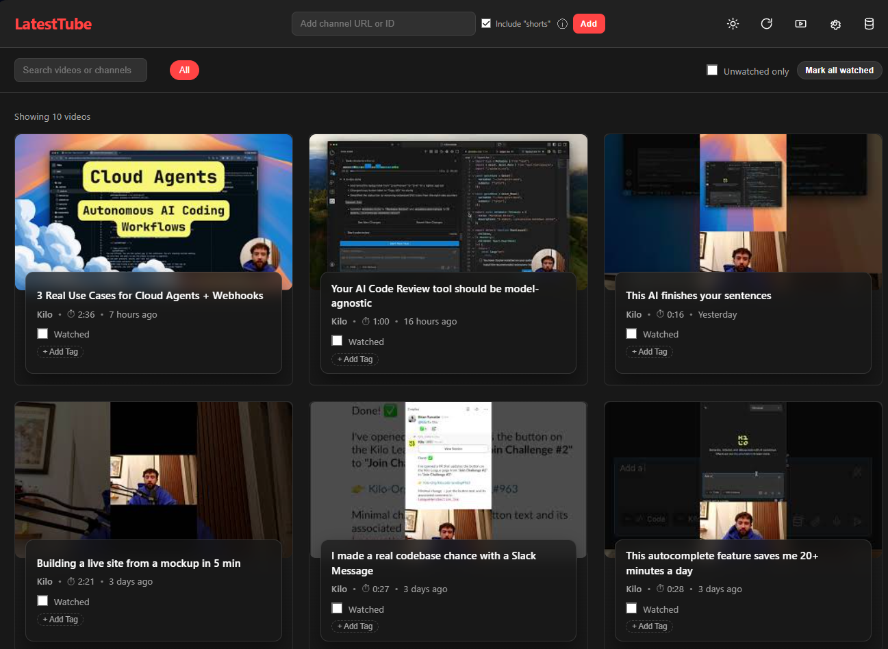

# LatestTube

Your personal You Tube Channel tracker - get informed when your favorite channels have new videos available - just this, nothing else. Everything is private to you - everything is stored in your browser indexed DB.

All you need is a You Tube API Key

## What is LatestTube

LatestTube is a simple, privacy-focused tool for tracking videos from your favorite YouTube channels. It's designed as a single HTML file that you can open directly in your browser—no installation, no build step, and no server required.

**Key highlights:**

- **No deploy needed**: Simple open `index.html` in a browser
- **Privacy-focused**: All data stays in your browser's IndexedDB; no accounts, no tracking, no data leaves your device—you have full control
- **Zero external dependencies**: No npm packages, no CDNs, no frameworks—just vanilla JavaScript

## Features

- 📺 **Track multiple YouTube channels** — Keep tabs on all your favorite creators in one place
- 🔄 **Automatic video fetching** — Pulls latest video metadata from channel uploads playlists
- 🏷️ **Tag videos for organization** — Categorize videos by topic, priority, or anything you like
- 🔍 **Filter by tags and watched status** — Focus on unwatched content or specific topics
- ✅ **Mark videos as watched/unwatched** — Keep track of what you've seen
- 🌙 **Dark theme UI** — Easy on the eyes, day or night
- 🚫 **Zero external dependencies** — Self-contained, no third-party libraries

## Getting Started

### a. Get a YouTube Data API v3 Key

Before you can use LatestTube, you'll need a free API key from Google:

1. Go to [Google Cloud Console](https://console.cloud.google.com/)
2. Create a new project (or use an existing one)
3. Enable **"YouTube Data API v3"** for your project
4. Go to **Credentials** → **Create API Key**
5. Copy the API key (it starts with `AIza...`)

> 💡 **Note**: The free tier includes 10,000 quota units per day, which is plenty for personal use (approximately 300 full refreshes).

### b. Open LatestTube

No installation required:

1. Simply open `index.html` in Chrome, Firefox, Opera or Edge
2. No build step or server needed
3. Works directly from `file://` protocol—just double-click the file

## Usage

### a. Setting Up Your API Key

On first launch:

1. You will be greeted by the welcome screen
2. Getting started will open the settings 
3. Paste your YouTube API key in the input field
4. Ajust default values (optional)
5. Click **"Save"**

Your API key is stored locally in your browser and is never sent anywhere except to YouTube's API.

### b. Adding Channels

To start tracking channels:

1. Enter a YouTube channel URL, handle, or ID in the input field in the header area
2. Click **"Add"** (or press Enter)

**Supported formats:**

| Format | Example |
|--------|---------|
| Handle | `@channelname` |
| Channel ID | `UCxxxxxxxxxxxxxxxxxxx` |
| Handle URL | `https://www.youtube.com/@channelname` |
| Channel URL | `https://www.youtube.com/channel/UCxxxx` |

Videos will be listed automatically after adding a channel.

### c. Browsing and Filtering Videos

Once channels are added:

- Videos appear sorted by publish date (newest first)
- Use **tag filter chips** at the top to show only videos with specific tags
- Check **"Unwatched only"** to hide videos you've already seen
- Click **"Load More"** to see additional videos beyond the initial batch

### d. Tagging Videos

Organize your videos with custom tags:

1. Click **"+ Add Tag"** on any video card
2. Type a tag name or select from existing tags
3. Press **Enter** or click **"Add"**

Tags help you organize videos by topic, priority, or any system that works for you.

### e. Marking Videos as Watched

Keep track of what you've seen:

1. Click the checkbox next to **"Watched"** on any video
2. Watched videos show with a strikethrough title for easy identification
3. Use the **"Unwatched only"** filter to focus on new content

### f. Refreshing

Check for new videos:

1. Click the refresh button (↻) in the header to check for new videos
2. The app also auto-refreshes on page load if more than 30 minutes have passed since the last check

## Technical Details

| Aspect | Details |
|--------|---------|
| **Architecture** | Single HTML file with separate JS/CSS/images modules |
| **Storage** | Browser's IndexedDB for channels, videos, tags, and settings |
| **API Usage** | Uses efficient `playlistItems` endpoint (1 quota unit per 50 videos) |
| **Quota** | Default 10,000 units/day = ~300 full refreshes |
| **Offline Support** | Works offline after initial video list fetch; no network required for browsing the cached list (to watch the video you need a connection of course) |

### How It Works

1. When you add a channel, LatestTube fetches the channel's "uploads" playlist ID
2. It then fetches video metadata (title, thumbnail, publish date) from that playlist using the YouTube Data API
3. Video metadata is stored locally in IndexedDB—you can browse your video list offline
4. Tags and watched status are also stored locally—your data never leaves your browser
5. Clicking a video opens it on YouTube—the app itself doesn't play videos

## Browser Compatibility

LatestTube works in all modern browsers that support IndexedDB:

| Browser | Minimum Version |
|---------|-----------------|
| Chrome | 80+ |
| Firefox | 75+ |
| Edge | 80+ |

**Requirements:**

- IndexedDB support (for local data storage)
- ES6 JavaScript support
- Modern CSS (Grid/Flexbox)

## Privacy & Security

- **No data collection**: We don't collect any data about you or your usage
- **Local storage only**: All data (channels, video metadata, tags, API key) stays in your browser's IndexedDB
- **Full user control**: You can view, export, or delete all stored data directly in your browser
- **Direct API calls**: Your API key is only used to call YouTube's API directly from your browser
- **No third parties**: No analytics, no tracking, no external scripts

## License

LatestTube is open source and available under the [MIT License](https://opensource.org/licenses/MIT).

### What this means:

- ✅ You can use, copy, modify, merge, publish, distribute, sublicense, and/or sell copies of this software
- ✅ You must include the copyright notice and permission notice in all copies or substantial portions of the software
- ✅ This software is provided "as is", without warranty of any kind

### Why MIT?

The MIT License was chosen because it:
- Allows maximum freedom for users to adapt the software to their needs
- Is simple and easy to understand
- Is compatible with nearly all other licenses
- Matches the privacy-first philosophy of LatestTube — use it however you want, just keep the credit
